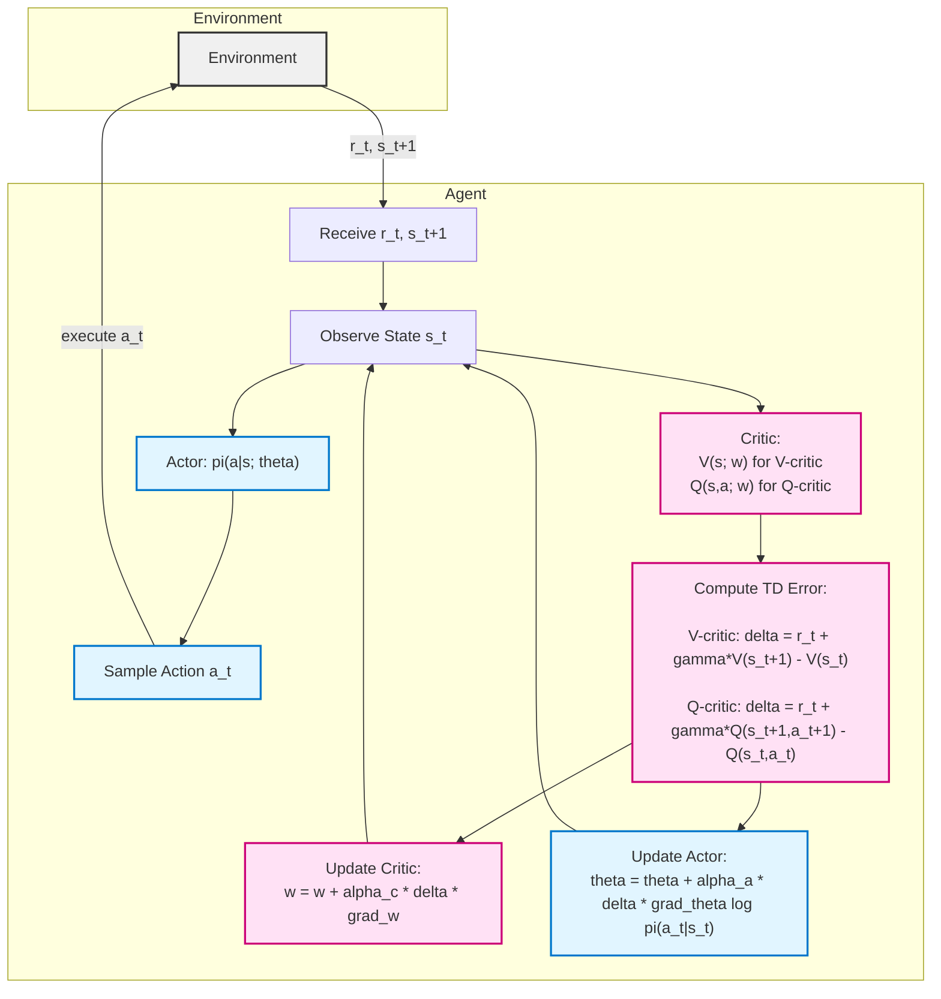

# 🎭 The Actor–Critic Method: Bridging Policy-Based and Value-Based Reinforcement Learning

The **Actor–Critic (AC)** method is a foundational algorithm in Reinforcement Learning that elegantly **combines the strengths of Policy-Based and Value-Based methods**.  
It uses two neural networks — the **Policy Network (Actor)** and the **Value Network (Critic)** — trained together in a feedback loop.  
The actor learns *how to act*, and the critic learns *how good the action was*.

## 🧩 1. Dual-Network Structure

The Actor–Critic framework introduces two interconnected approximations:

### 🎬 Policy Network (Actor)

- **Role:** Approximates the optimal policy $\pi(a \mid s)$; determines how the agent behaves.  
- **Notation:** $\pi(a \mid s; \theta)$, where $\theta$ are the actor’s trainable parameters.  
- **Input/Output:**  
  - **Input:** current state $s$ (e.g., a screenshot of Super Mario).  
  - **Output:** probability distribution over the action set $A$.  
  - Uses **Softmax** activation to ensure probabilities sum to one:  
    $$
    \sum_{a \in A} \pi(a \mid s; \theta) = 1
    $$
- **Example Output:**  
  - $\pi(\text{"left"} \mid s) = 0.2$  
  - $\pi(\text{"right"} \mid s) = 0.1$  
  - $\pi(\text{"up"} \mid s) = 0.7$

### 🧠 Value Network (Critic)

- **Role:** Approximates the **Action-Value Function** $( Q_\pi(s,a) )$, which measures how good an action is given the current state.  
- **Notation:** $( q(s,a; w) )$, where $( w )$ are the critic’s trainable parameters.  
- **Input/Output:**  
  - Input: the current state $( s )$.  
  - Output: predicted Q-values for all possible actions.
- **Example Output:**  
  $( q(s, "left"; w) = 2000 )$,  
  $( q(s, "right"; w) = 1000 )$,  
  $( q(s, "up"; w) = 3000 )$

The **State-Value Function** can be approximated by combining both networks:
$[
V(s; \theta, w) \approx \sum_{a} \pi(a|s; \theta) \, q(s,a; w)
]$

## 🔁 2. Training Iteration: One Step of the Actor–Critic Algorithm

Each iteration consists of **two key update phases** — first the **Critic**, then the **Actor** — based on a single environment interaction.

### 🧭 A. Interaction and Data Gathering

1. **Observe State and Sample Action:**  
   - Observe the current state $( s_t )$.  
   - The Actor samples an action according to the current policy:  
     $[
     a_t \sim \pi(\cdot | s_t; \theta_t)
     ]$

2. **Perform Action:**  
   - Execute $( a_t )$ in the environment.  
   - Observe **reward** $( r_t )$ and **next state** $( s_{t+1} )$.

3. **Sample Next Action (for TD target):**  
   - For learning only (not executed), sample a next action:  
     $$
     a'_{t+1} \sim \pi(\cdot \mid s_{t+1}; \theta_t)
     $$

### ⚖️ B. Update the Value Network (Critic) via Temporal Difference (TD) Learning

The Critic learns to better estimate future returns.

4. **Evaluate Critic:**  
   $[
   q_t = q(s_t, a_t; w_t)
   ]$
   $[
   q'_{t+1} = q(s_{t+1}, a'_{t+1}; w_t)
   ]$

5. **Compute TD Error (δₜ):**  
   Measures how far the prediction is from the target return:
   $[
   \delta_t = q_t - (r_t + \gamma \cdot q'_{t+1})
   ]$
   where $( \gamma )$ is the discount factor.

6. **Differentiate Critic:**  
   Compute the gradient of the Q-function with respect to $( w )$:  
   $[
   d_{g,t} = \frac{\partial q(s_t, a_t; w)}{\partial w}
   ]$

7. **Update Critic Parameters (Gradient Descent):**
   $[
   w_{t+1} = w_t - \alpha \cdot \delta_t \cdot d_{g,t}
   ]$
   $( \alpha )$ is the Critic’s learning rate.

This update helps the critic produce more accurate estimates of $( Q_\pi(s,a) )$.

### 🎯 C. Update the Policy Network (Actor) via Policy Gradient

The Actor learns to choose actions that **increase the critic’s estimated value**.

8. **Differentiate Actor:**  
   Compute the gradient of the log-policy with respect to $( \theta )$:  
   $[
   d_{\pi,t} = \frac{\partial \log \pi(a_t | s_t; \theta)}{\partial \theta}
   ]$

9. **Update Actor Parameters (Gradient Ascent):**  
   The policy parameters are updated toward actions the critic deems better:
   $[
   \theta_{t+1} = \theta_t + \beta \cdot q_t \cdot d_{\pi,t}
   ]$
   $( \beta )$ is the Actor’s learning rate.  
   The product $( q_t \cdot d_{\pi,t} )$ represents the **stochastic policy gradient estimate** $( g(a_t, \theta_t) )$.

## ⚙️ 3. The Actor–Critic Feedback Loop

The two networks **learn from each other**:

- The **Actor** produces actions and learns from the Critic’s evaluations.  
- The **Critic** evaluates those actions and improves using the rewards from the environment.  
- Over time:
  - The Actor becomes better at selecting rewarding actions.
  - The Critic becomes better at judging those actions.

This tight feedback loop allows **continuous learning during interaction** — faster and smoother than pure Monte Carlo methods like REINFORCE.

## 📈 4. Summary of the Full Algorithm

### 🔁 Actor–Critic Update Steps (Q-Critic vs V-Critic)

| **Step** | **Operation** | **Network** | **Learning Type** |
|-----------|----------------|--------------|--------------------|
| 1 | Observe state $s_t$ | — | — |
| 2 | Sample action $a_t \sim \pi(\cdot \mid s_t; \theta_t)$ | Actor | — |
| 3 | Execute $a_t$, observe $s_{t+1}$, $r_t$ | Environment | — |
| 4 | Sample $a'_{t+1} \sim \pi(\cdot \mid s_{t+1}; \theta_t)$ | Actor | — |
| 5 | Compute TD error $\delta_t = r_t + \gamma q'_{t+1} - q_t$ | Critic | Supervised (TD) |
| 6 | Update $w_{t+1} = w_t + \alpha_c \, \delta_t \, \nabla_w q(s_t, a_t; w_t)$ | Critic | Gradient Descent |
| 7 | Compute $d_{\pi,t} = \frac{\partial}{\partial \theta} \log \pi(a_t \mid s_t; \theta_t)$ | Actor | Policy Gradient |
| 8a | **Q-Critic (SARSA style):** $\theta_{t+1} = \theta_t + \beta_a \, q_t \, d_{\pi,t}$ | Actor | Gradient Ascent |
| 8b | **V-Critic (A2C style):** $\theta_{t+1} = \theta_t + \beta_a \, \delta_t \, d_{\pi,t}$ | Actor | Gradient Ascent |

- **Q-Critic (SARSA style)**  
  Uses $q_t = Q(s_t, a_t; w_t)$ directly to weight the policy gradient.  
  → High variance but simple: no baseline subtraction.

- **V-Critic (A2C style)**  
  Uses the **TD error** $\delta_t = r_t + \gamma V(s_{t+1}) - V(s_t)$ as a low-variance estimate of the **Advantage**.  
  → This acts like a baseline, promoting actions that are better than expected.

## 🧠 5. Intuitive Understanding

- **Actor (Policy Network):** Learns the *strategy* — which actions to take.
- **Critic (Value Network):** Learns to *evaluate* that strategy by predicting how rewarding each action is.
- **Together:** The Actor adjusts its behavior based on the Critic’s feedback; the Critic adjusts its judgment based on real rewards.

This design makes Actor–Critic methods more **sample-efficient and stable** than pure policy gradient methods, and more **flexible** than value-based methods like DQN.

> **In short:**  
> The Actor–Critic method unifies decision-making and evaluation.  
> The **Actor** improves its policy using gradients guided by the **Critic’s value estimates**,  
> while the **Critic** refines its judgment using real environmental rewards —  
> creating a closed loop of continuous, mutually beneficial learning.

## 6. Inputs and Outputs of the Actor–Critic Networks

In the Actor–Critic framework, two neural networks work together:  
the **Policy Network (Actor)** and the **Value Network (Critic)**.  
Each serves a distinct role — the Actor decides *what to do*, and the Critic evaluates *how good that decision was*.

### 🎭 Policy Network (Actor)

The **policy network**, parameterized by $\theta$, approximates the policy function $\pi(a|s; \theta)$.  
It controls the agent’s behavior, producing a probability distribution over actions for a given state.

| **Function** | **Input** | **Output** | **Details** |
|---------------|------------|-------------|--------------|
| **Input** | State $s$ | — | The input is the current environment state, which can be a high-dimensional signal (e.g., an image or sensor data). |
| **Output** | Probability distribution over actions | — | The network outputs a probability distribution $\pi(a \mid s; \theta)$ over all possible actions $a \in \mathcal{A}$. These probabilities sum to 1: $\sum_{a \in \mathcal{A}} \pi(a \mid s; \theta) = 1$. |
| **Sampling** | — | Action $a_t$ | During interaction, the agent samples an action from this distribution: $\boldsymbol{a_t \sim \pi(\cdot \mid s_t; \theta)}$. |
| **Learning Rule** | — | Updated $\theta$ | The Actor is updated using the **policy gradient** to increase the expected state-value $V(s; \theta, w)$ and favor actions with higher estimated returns. |

🧩 *Typically, a Softmax activation function* is applied in the final layer to ensure the outputs form a valid probability distribution.

### ⚖️ Value Network (Critic)

The **value network**, parameterized by $w$, approximates the **action-value function** $Q_\pi(s, a)$, denoted as $q(s, a; w)$.  
Its role is to judge how good the Actor’s chosen action was, providing a training signal.

| **Function** | **Input** | **Output** | **Details** |
|---------------|------------|-------------|--------------|
| **Input** | State $s$ | — | The network receives the same state $s$ observed by the Actor. |
| **Output** | Action-values $q$ | — | The Critic outputs estimated Q-values for every possible action: $q(s, \text{"left"}; w)$, $q(s, \text{"right"}; w)$, etc. |
| **Usage** | — | TD Target | These values are used to compute the **Temporal Difference (TD) target**, which evaluates how much the Actor’s decision improved the expected future reward. |
| **Learning Rule** | — | Updated $w$ | The Critic is trained using **TD learning** (e.g., minimizing $(r_t + \gamma q(s_{t+1}, a'; w) - q(s_t, a_t; w))^2$) to make its predictions closer to observed rewards. |

Over time, the Critic’s Q-value predictions become more accurate, stabilizing policy updates.

### 🔗 Relationship Between Actor and Critic

The Actor and Critic interact mathematically through the **approximate state-value function**, defined as:

$$
V(s; \theta, w) = \sum_{a \in \mathcal{A}} \pi(a \mid s; \theta) \, q(s, a; w)
$$

- The **Actor** provides the action probabilities $\pi(a \mid s; \theta)$.  
- The **Critic** provides the corresponding action-value estimates $q(s, a; w)$.  
- Together, they form an expectation of the return from state $s$ under the current policy.

This coupling allows the Actor to **learn from the Critic’s feedback** —  
increasing the probability of actions that lead to higher predicted returns and reducing the probability of poor ones.

### 🧭 Summary

| **Network** | **Parameters** | **Input** | **Output** | **Learning Type** | **Purpose** |
|--------------|----------------|------------|--------------|--------------------|--------------|
| **Actor (Policy Network)** | $\theta$ | State $s$ | Probability distribution $\pi(a \mid s; \theta)$ | Policy Gradient | Chooses actions and updates toward higher-value behaviors |
| **Critic (Value Network)** | $w$ | State $s$ | Action-values $q(s, a; w)$ | TD Learning | Evaluates the Actor’s performance and provides feedback |

Together, the two networks form the foundation of **Actor–Critic Reinforcement Learning**, blending the strengths of **policy optimization** and **value estimation**.

## 🧩 V-Critic vs. Q-Critic and Policy Updates with a Baseline

In reinforcement learning, different **Actor–Critic variants** use different forms of the Critic — either estimating the **state value function** $V(s)$ or the **action value function** $Q(s, a)$.  
These lead to two main styles of Actor–Critic algorithms: **V-Critic (A2C/A3C-style)** and **Q-Critic (SARSA-style)**.

### 💡 Policy Update with a Baseline

The **policy update with a baseline** is an essential refinement to the standard Actor–Critic algorithm.  
It improves training stability by focusing updates on actions that perform **better than average**, rather than on all actions proportionally to their raw Q-values.

#### Standard Policy Update (Without Baseline)

In the basic Actor–Critic framework, the policy parameters $\theta$ are updated proportionally to the **action-value estimate** $q_F = q(s_F, a_F; w_F)$.

1. **Compute policy gradient:**

   $$
   d_{\pi, F} = \frac{\partial \log \pi(a_F | s_F; \theta)}{\partial \theta}
   $$

2. **Perform stochastic gradient ascent:**

   $$
   \theta_{F+1} = \theta_F + \beta \, q_F \, d_{\pi, F}
   $$

Here, $q_F$ acts as a *scaling factor*, weighting how strongly each sampled action should influence the policy update.

#### Adding a Baseline to Reduce Variance

The problem with using $q_F$ directly is that it can introduce **high variance** — even “average” or bad actions can cause large gradient updates.

To address this, we introduce a **baseline** $b(s)$, typically the state-value function $V(s)$.  
This transforms the update rule to use the **Advantage Function**:

$$
A(s, a) = Q(s, a) - V(s)
$$

Then the policy gradient becomes:

$$
\nabla_\theta J(\theta) = \mathbb{E}[\nabla_\theta \log \pi(a|s; \theta) \, (Q(s, a) - V(s))]
$$

#### Policy Update with Baseline (Advantage-Based TD Error)

In the notation used in the sources:

- $q_F = q(s_F, a_F; w_F)$ — Critic’s Q-value estimate  
- $\delta_F = q_F - (r_F + \gamma q_{F+1})$ — Temporal Difference (TD) error  
- $\delta_A$ — advantage-based TD error (when using a baseline)

Then the **policy update with a baseline** becomes:

$$
\theta_{F+1} = \theta_F + \beta \, \delta_A \, d_{\pi, F}
$$

where:

$$
\delta_A \approx r_F + \gamma V(s_{F+1}) - V(s_F)
$$

This update means:
- If the observed return is **better than expected** ($\delta_A > 0$), increase the probability of taking that action.
- If it’s **worse than expected** ($\delta_A < 0$), decrease it.

#### 🧠 Why It Works

Subtracting the baseline does **not bias** the gradient because the expectation of the baseline term is zero:

$$
\mathbb{E}[\nabla_\theta \log \pi(a|s; \theta) \, b(s)] = 0
$$

This ensures that:
- The policy update remains **unbiased** (still points in the right direction).
- But it becomes **lower variance**, improving stability and convergence speed.

💡 **Intuition:**  
Using a baseline turns the raw Q-value signal into a *relative measure* — “Was this action better than usual?”  
The Actor is only rewarded when actions exceed the Critic’s expectations, leading to more stable and meaningful learning updates.

### Do We Need Both V and Q Networks?

In general, **you don’t need both** — it depends on whether your Critic learns **V(s)** or **Q(s,a)**.

#### ✅ 1️⃣ **V-Critic (A2C / A3C / PPO style)** — **Yes**, you need a **Value Network** $V(s)$

In this setup:
- The **Critic** learns $V(s; w_V)$ — the expected return from a given state.
- The **Actor** learns $\pi(a|s; \theta)$ — how to choose actions.
- The **Advantage** is computed as:
  $$
  A(s,a) = r_t + \gamma V(s_{t+1}) - V(s_t)
  $$
- You **do not need** a Q-network here — the value network provides the *baseline*.

So the system has:
- One **Actor Network** (policy)
- One **Critic Network** (value function $V$)

#### ✅ 2️⃣ **Q-Critic (SARSA / Classic AC style)** — **No**, you only need a **Q Network** $Q(s,a)$

In this setup:
- The **Critic** learns $Q(s,a; w_Q)$ — the expected return for each state–action pair.
- The **Actor** uses the Q-values directly for updates:
  $$
  \theta \leftarrow \theta + \alpha_a \, Q(s_t, a_t) \, \nabla_\theta \log \pi(a_t|s_t; \theta)
  $$
- There’s **no explicit baseline**, but this approach typically has higher variance.

#### 💡 3️⃣ **Hybrid or Advanced Versions**

Some modern algorithms (like **DDPG**, **SAC**) include **both**:
- A **Q-network** to learn action-specific value.
- A **V-network** (or soft value) to stabilize learning, e.g.:
  $$
  V(s) = \mathbb{E}_{a \sim \pi} [ Q(s,a) - \alpha \log \pi(a|s) ]
  $$
This is used in **continuous action** RL.

#### 🧭 Summary

| Algorithm Type | Critic Learns | Networks Needed | Advantage Computed From |
|----------------|----------------|------------------|--------------------------|
| A2C / A3C / PPO | $V(s)$ | Actor + Value | $A = r + \gamma V(s') - V(s)$ |
| Classic AC / SARSA | $Q(s,a)$ | Actor + Q | $A = Q(s,a)$ (no baseline) |
| DDPG / SAC | Both $Q(s,a)$ and $V(s)$ | Actor + Q + V | Uses both for stability |

**In short:**  
You only need *one* Critic network — either $Q$ or $V$ — depending on the algorithm.  
But if you want a *baseline* (Advantage-based learning), then yes — that means adding a **V-network** alongside your Actor.

### V-Critic (A2C / A3C Style)

**V-Critic** methods use the **state-value function** $V(s; w)$ as the Critic’s prediction target.

The idea: instead of estimating $Q(s, a)$ for every action, the Critic learns how good it is to be in a given state — *averaged over the policy’s actions*.

**Advantage Actor–Critic (A2C/A3C)** uses this setup.

- **Critic’s role:**
  $$
  \text{TD Target: } y_t = r_t + \gamma V(s_{t+1}; w)
  $$
  $$
  \text{TD Error: } \delta_t = y_t - V(s_t; w)
  $$
   - **Input:** A state $s_t$  
   - **Output:** A scalar $V(s_t)$ — the expected *future return* from that state under current policy $\pi$
      - **Training Target (TD target):**
   $$
   y_t = r_t + \gamma V(s_{t+1}; w)
   $$
   - **TD Error (Advantage Estimate):**
   $$
   \delta_t = y_t - V(s_t; w) = r_t + \gamma V(s_{t+1}) - V(s_t)
   $$
   - **Update Rule:**
   $$
   w \leftarrow w + \alpha_c \, \delta_t \, \nabla_w V(s_t; w)
   $$

- **Actor’s update rule:**
  $$
  \theta \leftarrow \theta + \alpha_a \, \delta_t \, \nabla_\theta \log \pi(a_t | s_t; \theta)
  $$

Here, the TD error $\delta_t$ acts as an **advantage estimate**, measuring how much better or worse the chosen action performed compared to expectation.

**Interpretation:**  
- Here the Critic doesn’t evaluate individual actions, just the overall quality of a state.  
- To train it, you **sample states** from trajectories generated by the current policy $\pi$.  
- Then you compare what the Critic *predicted* ($V(s_t)$) versus what *actually happened* ($r_t + \gamma V(s_{t+1})$).

✅ Works well for **continuous actions**  
✅ Enables **Advantage-based** learning (lower variance)
❌ Doesn’t tell you directly which action is best — relies on the Actor to explore and learn from $\delta_t$ feedback.

✅ **Used in:**  
A2C (Advantage Actor–Critic), A3C (Asynchronous A2C), PPO, etc.  
These methods are efficient and stable because they use **state-based feedback** rather than raw returns.

🧠 **Intuition:**
- The V-critic gives a **baseline expectation** for the state’s value.
- The Actor learns to adjust the policy based on how much better or worse an action performed *relative to this baseline*.

### Q-Critic (SARSA-Style Actor–Critic)

In **Q-Critic** methods, the Critic directly approximates the **action-value function** $Q(s, a; w)$.

- **Critic’s role:**
  $$
  \text{TD Target: } y_t = r_t + \gamma Q(s_{t+1}, a_{t+1}; w)
  $$
  $$
  \text{TD Error: } \delta_t = y_t - Q(s_t, a_t; w)
  $$

   - **Input:** A state $s_t$ and an action $a_t$  
   - **Output:** A scalar $Q(s_t, a_t)$ — the expected *future return* from doing $a_t$ in $s_t$
   - **Training Target (TD target):**
   $$
   y_t = r_t + \gamma \max_{a'} Q(s_{t+1}, a'; w)
   $$
   - **TD Error:**
   $$
   \delta_t = y_t - Q(s_t, a_t; w)
   $$
   - **Update Rule:**
   $$
   w \leftarrow w + \alpha_c \, \delta_t \, \nabla_w Q(s_t, a_t; w)
   $$
- **Actor’s update rule:**
  $$
  \theta \leftarrow \theta + \alpha_a \, \delta_t \, \nabla_\theta \log \pi(a_t | s_t; \theta)
  $$

This version resembles **SARSA** because it uses the *actual next action* $a_{t+1}$ (sampled from the policy) in its TD target rather than the maximum Q-value over all actions.

✅ **Used in:**  
Classical Actor–Critic formulations and SARSA-based policy gradient hybrids. 

**Interpretation:**  
- At each step, the network learns *how good each action is* in the current state.  
- Given a new state, it outputs a vector of Q-values for all actions —  and the Actor (or greedy policy) picks the action with the highest Q.

✅ Works well for **discrete action spaces**  
❌ Hard to apply to **continuous actions**, because you’d have to take $\max_a$ over infinitely many $a$.

🧠 **Intuition:**
- The Q-Critic gives **action-specific** feedback.
- The Actor learns which actions are directly responsible for the observed reward signal.

### ⚖️ Comparison: V-Critic vs. Q-Critic

| Type | Critic Learns | TD Target | Update Type | Used In |
|------|----------------|-----------|--------------|----------|
| **V-Critic (A2C/A3C)** | $V(s)$ | $r_t + \gamma V(s_{t+1})$ | Advantage-Based | A2C, A3C, PPO |
| **Q-Critic (SARSA-style)** | $Q(s,a)$ | $r_t + \gamma Q(s_{t+1}, a_{t+1})$ | Action-Based | SARSA, Classic AC |

